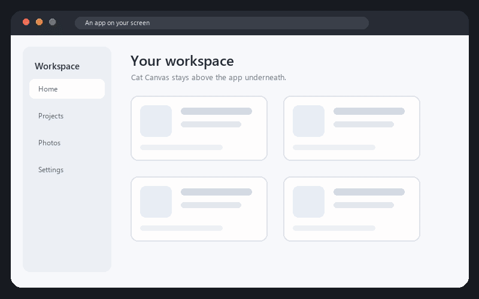
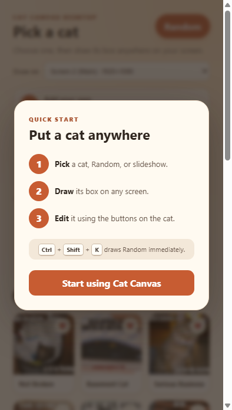

# Cat Canvas Desktop

[](https://github.com/Yusuf-Karanib/cat-canvas-desktop/actions/workflows/test.yml)


Put temporary cat photos and GIFs above any app on your Windows screen.

Prefer a browser-only version? Try the [Cat Canvas Chrome extension](https://github.com/Yusuf-Karanib/cat-canvas).



## What it does

- Press `Ctrl+Shift+K` to draw a Random cat immediately
- Choose from four safe keyboard shortcuts for drawing Random
- Pick from 12 licensed meme images and 12 licensed GIFs
- Add your own JPG, PNG, WebP, or GIF
- Run a slideshow using Random, Favorites, My media, or GIFs
- Choose any connected monitor before drawing
- Draw the exact box where the cat should appear
- Random cats match wide, tall, and square boxes
- Move, resize, replace, send to the next screen, lock, or remove placed cats
- Use the tray icon to open the picker, unlock cats, clear the screen, or quit
- Optionally start quietly in the Windows tray after sign-in
- Follow a three-step guide the first time you open the app
- Everything stays on your computer
- Every placed cat disappears when the app closes

Cat Canvas Desktop draws on a transparent layer above your apps. It does not change the apps underneath it.

## Download for Windows

[Download the latest version](https://github.com/Yusuf-Karanib/cat-canvas-desktop/releases/latest)

This first release is not code-signed, so Windows may show a SmartScreen warning. The complete source code is public here for inspection. Do not download copies from unrelated websites.

## Controls

1. Open Cat Canvas Desktop.
2. Choose a cat, or press `Ctrl+Shift+K` for Random.
3. Drag a box anywhere on your main screen.
4. Hover over the cat to move, replace, send it to the next screen, lock, or remove it.
5. Drag its bottom-right corner to resize it.

Select **How it works** in the picker to reopen the quick guide.

Use **Random shortcut** in the picker to change the keyboard shortcut. If another app already uses your choice, Cat Canvas keeps the old shortcut.



For a slideshow, choose **Random**, **Favorites**, **My media**, or **GIFs**, choose its speed, then select **Media slideshow** and draw its box. Hover over it to go back, pause, play, or go forward.

A locked cat lets clicks pass through to the app underneath. Right-click the tray icon and choose **Unlock All Overlays** to edit it again.

## Run the source code

You need Node.js 24 or newer.

```powershell
npm install
npm start
```

Run the checks with `npm test`. Build the Windows download with `npm run build`.

## Project documents

- [Roadmap](ROADMAP.md)
- [Contributing](CONTRIBUTING.md)
- [Privacy](PRIVACY.md)
- [Media credits](ASSET-CREDITS.md)
- [Media licenses](ASSET-LICENSE.md)
- [Project rules](PROJECT-RULES.md)

## Licenses

The app code is MIT licensed. Bundled media keeps the separate licenses listed in [ASSET-CREDITS.md](ASSET-CREDITS.md).
